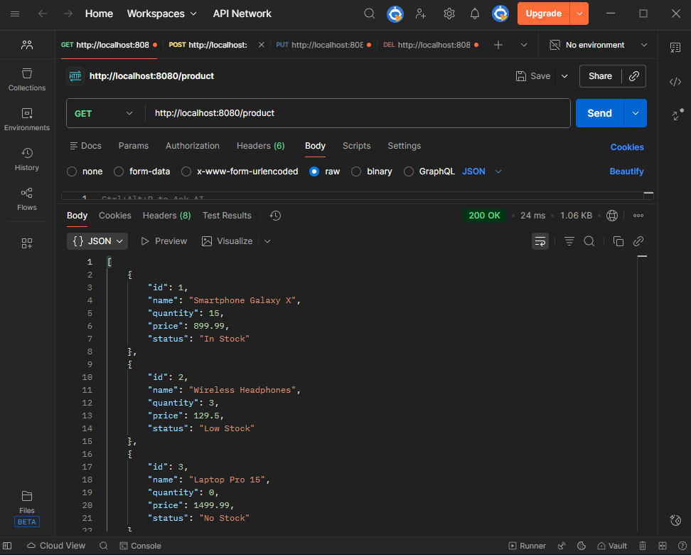
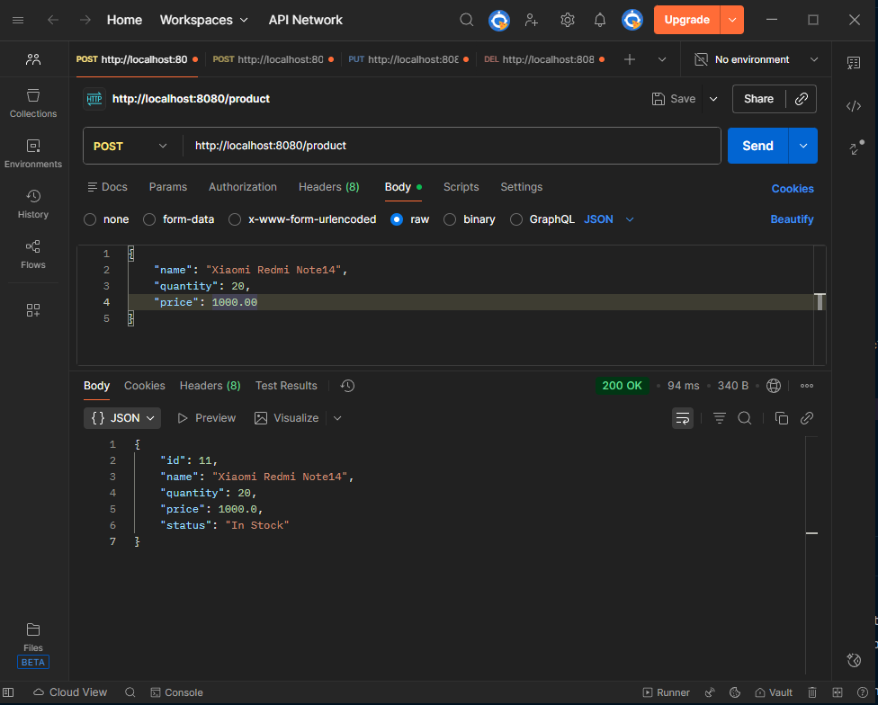
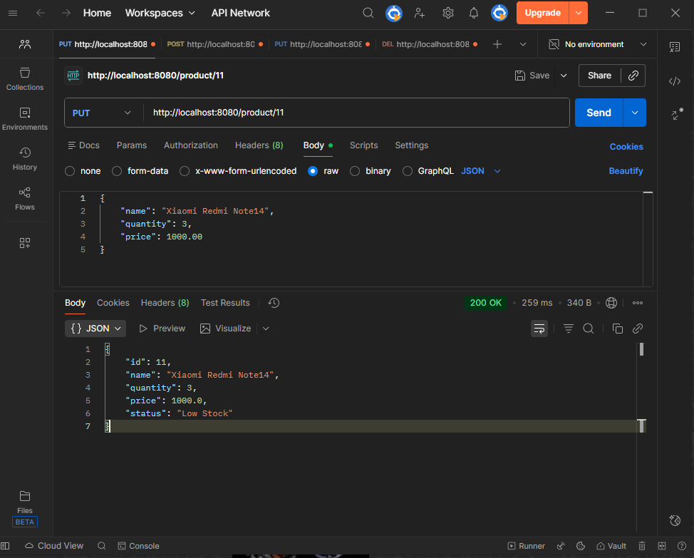

<h1>Product Management API </h1>

A complete REST API for product management developed with Spring Boot using layered architecture.

<h2>About the Project </h2>

RESTful API for CRUD (Create, Read, Update, Delete) operations on products, following Spring Boot development best practices with automatic stock status calculation.

<h3>Technologies Used </h3>

- **Java 21**
- **Spring Boot 3.4.12**
- **Spring Data JPA**
- **MySQL** (Production) / **H2** (Development)
- **Maven**
- **Postman** (API Testing)

<h3>Features </h3>

- **Complete CRUD** operations for products
- **Batch creation** of products
- **Automatic stock status calculation** based on business rules
- **Data validation**
- **Custom error handling**
- **Layered architecture** (Controller, Service, Repository, Model)
- **CORS configured** for frontend integration

<h3>Business Rules </h3>

<h3> Automatic Stock Status Calculation </h3>
<ul>
<li>Quantity ≤ 0 → No Stock</li>
<li>Quantity ≤ 5 → Low Stock</li>
<li>Quantity > 5 → In Stock</li> 
</ul>
<h3>API Endpoints </h3>

| Method | Endpoint | Description |
|--------|----------|-------------|
| POST | `/product` | Create a single product |
| POST | `/product/batch` | Create multiple products |
| GET | `/product` | List all products |
| GET | `/product/{id}` | Get product by ID |
| PUT | `/product/{id}` | Update product |
| DELETE | `/product/{id}` | Delete product |

<h2>How to Run the Project</h2>

<h3>Prerequisites</h3>
- Java 21
- MySQL
- Maven 3.6+

<h3>Database Configuration</h3>

1. **Create the database in MySQL:**
```sql
CREATE DATABASE product_db;
```

2. **Configure MySQL credentials in application.xml:**
```application.xml
spring:
    datasource:
        url: jdbc:mysql://localhost:3306/product_db
        username: root #Your MySQL user here
        password: admin123 # Your MySQL password here
        driver-class-name: com.mysql.cj.jdbc.Driver

    jpa:
        hibernate:
            ddl-auto: update
        show-sql: true
```
<h2> Project Structure </h2>

<pre><code>src/
├── main/<br>
│   ├── java/<br>
│   │   └── tiagoribeine/<br>
│   │       └── com.github/<br>
│   │           ├── controller/<br>
│   │           ├── model/<br>
│   │           ├── repository/<br>
│   │           └── service/<br>
│   └── resources/<br>
│       └── application.yml<br>
</code></pre>

<h2>Running the Application</h2>

1. Clone the repository
2. Configure environment variables
3. Run with Maven or Run the class RestProductCrudWithJavaSpringApplication.java:
```bash
"mvn spring-boot:run"
```
4. Access the application at: http://localhost:8080
   
<h2> Frontend Integration </h2>

<ul>
<li>A complete dark-themed frontend is available with:</li>
<li>Real-time product management</li>
<li>Automatic status display with color coding</li>
<li>Responsive design</li>
<li>CRUD operations through intuitive UI</li>
</ul>

After running the application, open the file [client-web-list.html](src/main/java/tiagoribeine/com/github/client/client-web-list.html)

<h2> API Testing with Postman </h2>

````declarative
GET http://localhost:8080/product
````
*Retrieve all products from the database*


````declarative
POST http://localhost:8080/product
````
*Create a new product with automatic status calculation*


````declarative
PUT http://localhost:8080/product/11
````
*Update a product with automatic new status calculation*
